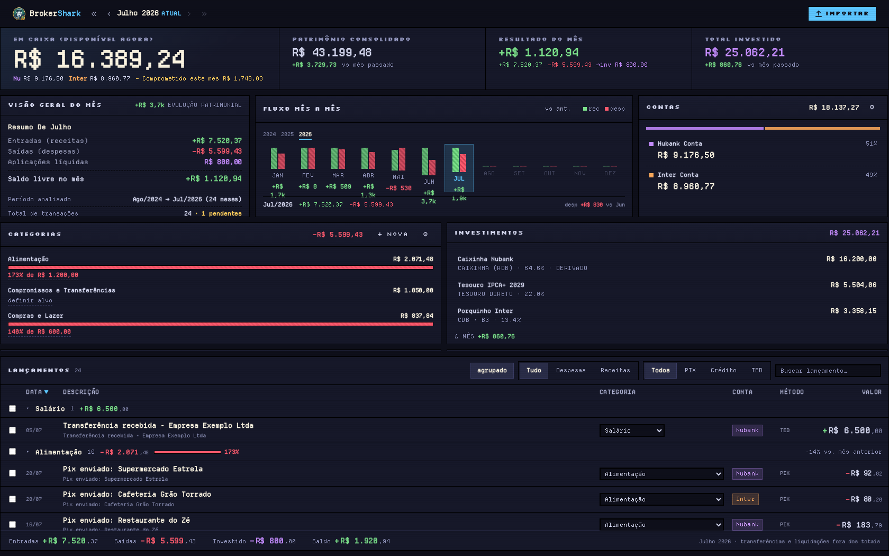
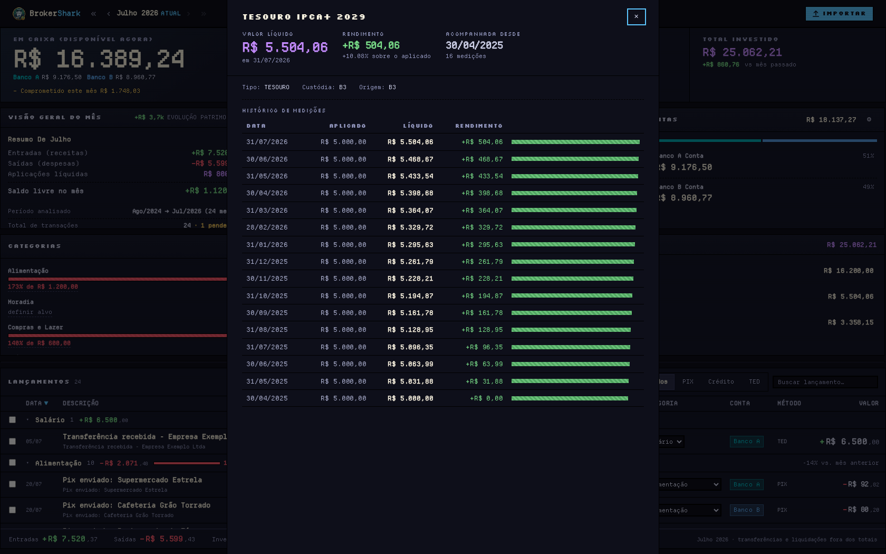
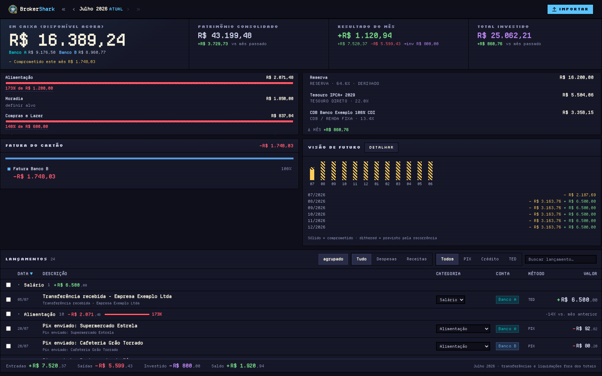

# BrokerShark

A personal finance dashboard that answers one question first: **how much can I spend right now?**

100% local, single user, no bank APIs, no cloud, no telemetry. The input is the CSV and
XLSX files Brazilian banks already export. Money is stored in **integer cents** — there
is no float anywhere in the ledger.

[](https://github.com/FelipeArtur/BrokerShark/actions/workflows/ci.yml)

*[Leia em português](README.pt-BR.md)*



*All figures in the screenshots come from the built-in synthetic ledger (`npm run demo`),
not from real accounts.*

---

## Why it exists

Budgeting apps answer "where did the money go?". That question is retrospective and, for
me, useless at the moment of decision. The question that actually governs a purchase is
**what is safe to spend today**, and answering it means subtracting what is already
committed — an open credit card invoice, installments still running — from what is
actually liquid.

So the hero number on screen is `available − committed`, and everything else is
arranged around defending it.

## The interesting part: the invariants

Most of the engineering here is not the UI. It is the set of rules that keep totals from
lying, each one learned from a number that was wrong on screen.

**A credit card invoice is counted once.** The itemized invoice lines are the real
expenses. The payment that shows up on the bank statement is a *settlement*
(`is_settlement=1`) and is excluded from spending totals. Count both and every month with
a card is inflated twice.

**Transfers between your own accounts are not expenses.** They are detected, never
declared: an outgoing leg and an incoming leg of the same amount, in different accounts,
within ±3 days, get paired (`self_pair_tx_id` on both sides). The pairing rewrites the
outgoing leg to `method='transfer'`, which is what keeps it out of consumption spending.

**...and a paired transfer is not an investment either.** This one cost me a real bug. An
investment contribution is also `flow='expense' AND method='transfer'` — the exact
signature the SELF pairing writes. Any query summing investments has to exclude
`self_pair_tx_id`, or moving money from account A to account B reads as "invested" and
the month's free balance silently shrinks. The frontend had it right and the backend did
not, and the disagreement between the two is what exposed it.

**Yield is computed, never stored as a claim.** Investment positions carry dated
snapshots; the return is the difference between them. A position that disappears from a
newer broker report is soft-closed, never deleted.

**Closing an account affects the present, never the past.** A closed account counts zero
in "what I have now" — not its last known balance — while every historical total ignores
the closure entirely, because the money really did move back then. And, like a real bank,
an account only closes when it is settled: a card with an open invoice or a checking
account in the red is refused.

**A new ledger starts with no categories at all.** Spending taxonomy is a personal
decision, not domain structure — the six categories this project ran on for months say
more about its author's life than about money, so nothing seeds them. Imported
transactions start uncategorized, which is a state the UI already knows how to show and
resolve in bulk, and the categories you create teach rules that suggest themselves next
time.

These rules live in one place in SQL (`backend/src/db/ledgerSql.ts`) rather than being
re-typed per query, because a copy that drifts makes two widgets disagree without failing
a single test.

Every rule above is enforced twice: as a unit test, and as an **audit query that runs
against the live database** (`npm run audit`, 17 checks). If a total on screen is lying,
the audit says so and exits non-zero.

## Screenshots

| Investment drill-down — yield computed across 16 dated measurements |
|---|
|  |

| Forward view — hard commitments plus recurrence detected from history |
|---|
|  |

## Running it

Requires **Node ≥ 26** (native type-stripping — the project has no build step).

```bash
cd backend
npm install                 # one dependency: xlsx
npm run demo                # builds a synthetic 24-month ledger at data/demo.db
npm start -- data/demo.db   # http://127.0.0.1:8000
```

The demo generator is not a fixture dump: it feeds transactions through the same
production modules the real importer uses (SELF pairing, savings derivation, itemized
invoice, payment reconciliation) and then runs the invariant audit against what it
produced, failing if anything broke. That is also why it is a CI step.

To use it with your own data, import statements through the UI (Nubank and Inter CSV,
Inter card invoice CSV, B3 consolidated XLSX) or rebuild from a directory of exports:

```bash
npm run backfill "<archive dir>"
```

## Testing

```bash
npm test     # 342 tests, node:test, backend + frontend
npm run audit # invariant checks against the live database, read-only
```

Pure domain logic (`domain/`, `frontend/js/domain/`) has no database or IO, so the part
that decides what money means is tested without infrastructure.

## Architecture

```
bank exports (CSV / XLSX)
      ↓
parsers + backfill  →  SQLite (WAL, foreign_keys=ON, chmod 0600)
                              ↓
                       node:http + SSE  →  React frontend (no build step)
```

| Layer | Choice |
|---|---|
| Language | TypeScript on Node ≥ 26, native type-stripping, no bundler |
| Database | SQLite via the builtin `node:sqlite` |
| Server | `node:http` plus a small router and SSE — zero dependencies |
| Frontend | React 18, vendored, plain hyperscript (never JSX), no CDN |
| Dependencies | One: `xlsx`, to read broker reports |

Bind is `127.0.0.1` only, with a Host allowlist (anti DNS-rebinding) and an Origin
allowlist on every non-GET method (anti-CSRF). The database file is `chmod 0600`: with no
auth layer, file permissions are the at-rest boundary. The frontend is fully vendored, so
a request to an external host is by definition illegitimate and the CSP blocks it.

## Non-goals

- **Multi-user, accounts, sync.** One person, one machine.
- **Mobile.** The screen is a dense desktop panel and does not pretend otherwise.
- **Bank APIs.** Open Finance would remove the file import, and add a credential surface
  this project deliberately does not have.
- **A desktop wrapper.** There was one; it was removed. A browser already solves it, and
  a second way to run the app is a second process lifecycle to keep alive.

## A note on the data

No ledger, statement, or export is versioned here, and none ever was — `data/` has been
in `.gitignore` since the first commit. The history was rewritten before this repository
went public to remove personal details that had leaked into test fixtures. Screenshots
and demo figures are synthetic.

## License

Published for evaluation and study — read it, run it, learn from it. It is **not** open
source: use in a product, or redistribution, needs written permission. See
[LICENSE](LICENSE).

---

Built by [Felipe Artur](https://github.com/FelipeArtur) with Claude Code. The repository's
`CLAUDE.md` is the single source of truth an AI agent loads on every session — schema,
accounts, invariants, architecture — and keeping it accurate is part of the workflow, not
an afterthought.
